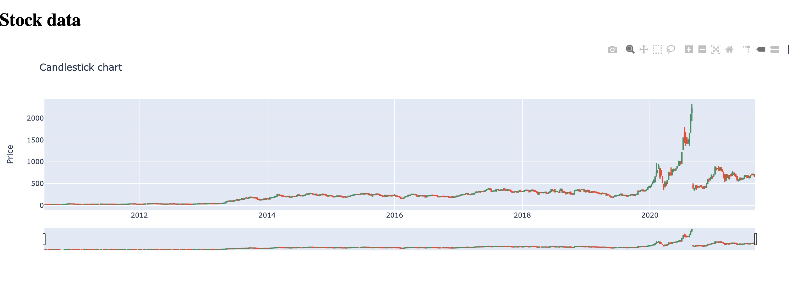
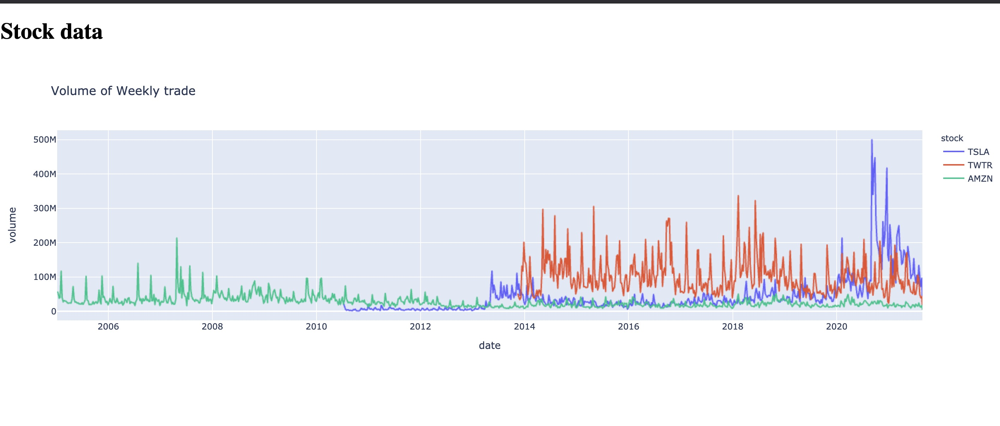

# quantiful_test

## To run
### Set up enviroment using conda.  
```
conda create --name <env> --file requirements.txt
```

### Task 1 ( cd into "Task1" )
```
python part1.py
```

### Task 2 ( cd into "Task2" )
```
python part1.py #Creates AlphaVantage.db file
python part2.py #Creates stock_avg_volume_per_year.csv file
```

### Task 3 ( cd into "Task3" )
```
python app.py
```
### part 1
```
http://127.0.0.1:5000/GET/stocks
```

### part 2
#### To show candlestick [Example candlestick]
```
http://127.0.0.1:5000/PLOT/candlestick/{STOCK_SYMBOL}

Example.
http://127.0.0.1:5000/PLOT/candlestick/AMZN
```
#### To show volume of weekly trade
```
http://127.0.0.1:5000/PLOT/volume
```


### Example candlestick


### Example volume



